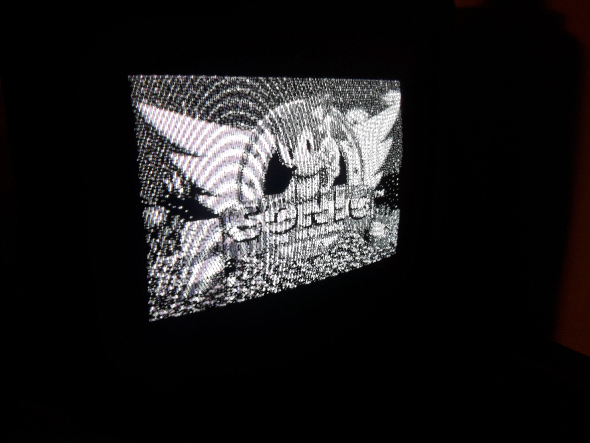

# avr-tv-pal

B/W PAL Text and Graphics display from an Atmega32 microcontroller running at 16Mhz, by reading an external RAM or ROM memory.
Graphics mode has a resolution of 256x192 pixels black and white.
Text mode has a resolution of 32x24 characters. Font map is fixed, stored in program memory.

Written in GNU AVR Assembler. 

It uses SPI as shift register to write bits into screen. Every 8th pixel is a bit larger than the others, there is one extra clock cycle there to load the shift register.

## Pinout
* Pin 1 - Output (PB0): Horizontal synchronization
* Pin 2 - Output (PB1): Bus request, intended for memory contention, active low.
* Pin 3 - Output (PB2): Output Enable / Chip Select, active low.
* Pin 4 - Input (PB3): Mode, 0: Text, 1: Graphics.
* Pin 6 - Output (PB4): the actual TV signal.
* Pins 14 - 21 - Inputs (PD0 - PD7): Data Lines D0-D7
* Pins 33 - 40 - Outputs (PA0 - PA7): Address lines A0-A7
* Pins 22 - 26 - Outputs (PC0 - PC4): Address lines A8 - A12

Recommend to put some capacitor on uCU between VCC and GND, given the high usage of IO pins. Here I used 4700uF just because that's what I had around.
